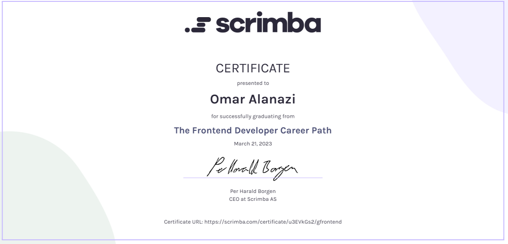
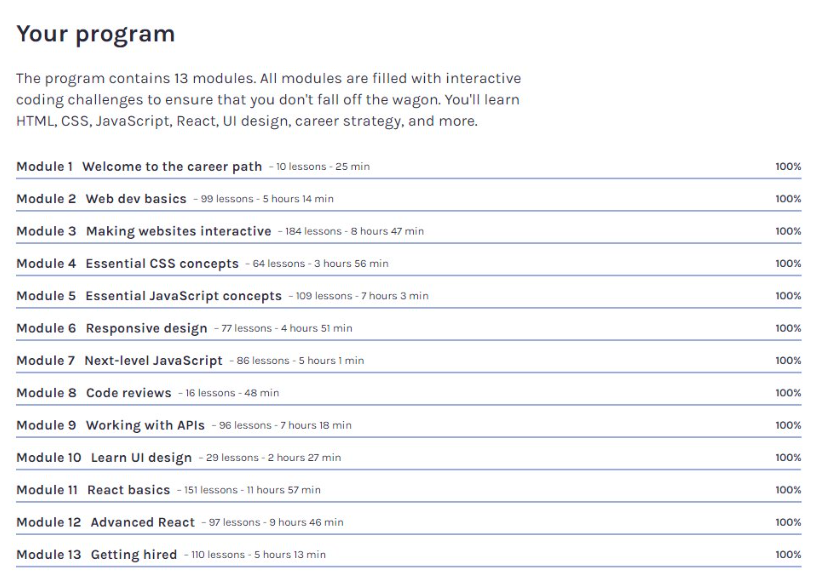

# Scrimba Front-end Program

## Course Overview
The [Scrimba Front-end Program](https://scrimba.com/learn/frontend) is a comprehensive program encompassing over 70 hours of content and spanning across a series of distinct modules. Each module is designed to provide in-depth knowledge and hands-on experience, featuring a diverse range of 40+ projects. This README will guide you through the objectives and outcomes of each module and offer links to the corresponding projects.

Please note that the Scrimba Front-end Program is continuously updated, so the course content may differ from what I experienced during my time in the program.

## Table of Contents
- [Module 1: Welcome to the career path](#module-1-welcome-to-the-career-path)
- [Module 2: Web dev basics](#module-2-web-dev-basics)
- [Module 3: Making websites interactive](#module-3-making-websites-interactive)
- [Module 4: Essential CSS concepts](#module-4-essential-css-concepts)
- [Module 5: Essential JavaScript concepts](#module-5-essential-javascript-concepts)
- [Module 6: Responsive design](#module-6-responsive-design)
- [Module 7: Next-level JavaScript](#module-7-next-level-javascript)
- [Module 8: Code reviews](#module-8-code-reviews)
- [Module 9: Working with APIs](#module-9-working-with-apis)
- [Module 10: Learn UI design](#module-10-learn-ui-design)
- [Module 11: React basics](#module-11-react-basics)
- [Module 12: Advanced React](#module-12-advanced-react)
- [Module 13: Getting hired](#module-13-getting-hired)
- [Acknowledgements](#acknowledgements)

## Module 1: Welcome to the career path

### Description
- Module 1 serves as an introduction to the Scrimba platform and the course structure, preparing students for the journey ahead and introducing them to their instructors.

### Projects
- No projects were provided in this module.

## Module 2: Web dev basics

### Description
- Web Dev Basics, I grasped the essential concepts of HTML and CSS, which are the backbone of web development. I started crafting layouts and applying styling to bring web designs to life.

### Projects
- [MyFirstPersonalSite](https://github.com/OmaralAnazi/MyFirstPersonalSite)
- [GoogleProject](https://github.com/OmaralAnazi/GoogleProject)
- [BusinessCard](https://github.com/OmaralAnazi/BusinessCard)
- [SpaceExploration](https://github.com/OmaralAnazi/SpaceExploration)
- [HappyBirthdaySite](https://github.com/OmaralAnazi/HappyBirthdaySite)
- [VisitSteveHouse](https://github.com/OmaralAnazi/VisitSteveHouse)

## Module 3: Making websites interactive

### Description
- In Module 3, I combined my foundational HTML and CSS knowledge with JavaScript to start building interactive websites. This step was crucial in enhancing the user experience and functionality of the web pages I created.

### Projects
- [PassengerCounter](https://github.com/OmaralAnazi/PassengerCounter)
- [Calculator](https://github.com/OmaralAnazi/Calculator)
- [BasketballScoreboard](https://github.com/OmaralAnazi/BasketballScoreboard)
- [BlackjackGame](https://github.com/OmaralAnazi/BlackjackGame)
- [PasswordGenerator](https://github.com/OmaralAnazi/PasswordGenerator)
- [LinksChromeExtenssion](https://github.com/OmaralAnazi/LinksChromeExtenssion)
- [UnitConversion](https://github.com/OmaralAnazi/UnitConversion)
- [YourEmojis](https://github.com/OmaralAnazi/YourEmojis)

## Module 4: Essential CSS concepts

### Description
- Module 4 was a deep dive into CSS, where I enhanced my styling skills and learned advanced techniques to create more sophisticated and visually appealing web designs.

### Projects
- [NFT-Site](https://github.com/OmaralAnazi/NFT-Site)
- [SimplePersonalSite](https://github.com/OmaralAnazi/SimplePersonalSite)
- [Oldagram](https://github.com/OmaralAnazi/Oldagram)
- [CoworkingSpace](https://github.com/OmaralAnazi/CoworkingSpace)

## Module 5: Essential JavaScript concepts

### Description
- In Module 5, I significantly leveled up my JavaScript skills, delving into more complex concepts and techniques. This module was a turning point in enhancing my ability to create dynamic and interactive web applications.

### Projects
- [CookieConsent](https://github.com/OmaralAnazi/CookieConsent)
- [CatMemePicker](https://github.com/OmaralAnazi/CatMemePicker)
- [Twimba](https://github.com/OmaralAnazi/Twimba)
- [RestaurantApp](https://github.com/OmaralAnazi/RestaurantApp)

## Module 6: Responsive design

### Description
- Module 6 focused on responsive design, a crucial skill for any frontend developer. I learned to ensure my websites are fully functional and visually appealing across all screen sizes, enhancing user experience and accessibility.

### Projects
- [NFT-Site2](https://github.com/OmaralAnazi/NFT-Site2)
- [ChefJobRegistration](https://github.com/OmaralAnazi/ChefJobRegistration)
- [LearningJournal](https://github.com/OmaralAnazi/LearningJournal)

## Module 7: Next-level JavaScript

### Description
- Module 7 took my JavaScript expertise to the next level. I delved deeper into the language, uncovering more advanced concepts and techniques that expanded my programming capabilities and understanding of JavaScript.

### Projects
- [WizardGame](https://github.com/OmaralAnazi/WizardGame)
- [TindogProject](https://github.com/OmaralAnazi/TindogProject)

## Module 8: Code reviews

### Description
- Module 8 introduced me to the practice of code reviews, emphasizing their importance in the development process. I not only learned the techniques of effective code reviewing but also applied these skills in conducting reviews for university students and during training camps in various university clubs. This experience significantly enhanced my understanding of collaborative development and code quality.

### Projects
- No projects were provided in this module. However, I plan to share insights from my review journey with other students on LinkedIn soon. Once I've posted my experiences, I'll provide the link here for further reading...

## Module 9: Working with APIs

### Description
- Module 9 was centered around working with Web APIs, the backbone of the web. I learned how to effectively utilize them and integrated this knowledge into building several projects. This module was instrumental in understanding the dynamic aspects of web development and data handling.

### Projects
- [BoredBotAPI](https://github.com/OmaralAnazi/BoredBotAPI)
- [BlogSpaceAPI](https://github.com/OmaralAnazi/BlogSpaceAPI)
- [ColorSchemeGenerator](https://github.com/OmaralAnazi/ColorSchemeGenerator)
- [WarGameAPI](https://github.com/OmaralAnazi/WarGameAPI)
- [MovieWatchlist](https://github.com/OmaralAnazi/MovieWatchlist)
- [PersonalDashboard](https://github.com/OmaralAnazi/PersonalDashboard)

## Module 10: Learn UI design

### Description
- In Module 10, I learned the essentials of UI design, focusing on creating applications that are not only functional but also aesthetically pleasing. The course emphasized the importance of UI fundamentals such as white space, color, contrast, scale, alignment, typography, and visual hierarchy, enabling me to design with an eye for both detail and usability.

### Projects
- No projects were provided in this module.
- However, [here](https://www.figma.com/file/KHpHrwmd262kbJc2TvTt98/Nutralle?type=design&node-id=0%3A1&mode=design&t=OAWjUDjJ4xsETHF2-1) I have included a UI design project from my university coursework.

## Module 11: React basics

### Description
- In Module 11, I began to explore React, the most popular library for building user interfaces. This module was a game-changer for me, significantly increasing my productivity. It introduced me to the core concepts of React, enabling me to construct dynamic and responsive UIs efficiently. The hands-on projects solidified my understanding, and I could see why React is favored by so many developers for its scalability and flexibility.

### Projects
- [ReactFunFacts](https://github.com/OmaralAnazi/ReactFunFacts)
- [DigitalBusinessCard](https://github.com/OmaralAnazi/DigitalBusinessCard)
- [AirBan](https://github.com/OmaralAnazi/AirBan)
- [TravelJournal](https://github.com/OmaralAnazi/TravelJournal)
- [MemeGenerator](https://github.com/OmaralAnazi/MemeGenerator)
- [TenziesGame](https://github.com/OmaralAnazi/TenziesGame)
- [Quizzical](https://github.com/OmaralAnazi/Quizzical)

## Module 12: Advanced React

### Description
- Module 12 was all about taking my React skills to a professional level. While we didn't dive deep into every advanced concept, we covered crucial topics like reusability, React Router, and performance optimization. These concepts are essential for writing clean and efficient React code, and the module equipped me with the know-how to start tackling more complex projects and contribute to large-scale applications.

### Projects
- No projects were provided in this module.

## Module 13: Getting hired

### Description
- Module 13 prepared me for the job market, focusing on acing frontend job interviews. It covered everything from JavaScript interview challenges to React-specific questions. The tips and techniques shared in this module were invaluable in helping me understand what employers look for and how to present my skills and knowledge confidently. This was the final push I needed to feel interview-ready and land my first job in the tech industry.

### Projects
- No projects were provided in this module.

## Acknowledgements
I, Omar Alanazi, extend my heartfelt thanks to the entire team at Scrimba for their exceptional effort in curating the Front-end Program. This course not only sharpened my technical skills but also provided a platform to expand my understanding of web development through hands-on projects and interactive learning. I am particularly grateful for the community support and the expert guidance that has been a constant throughout this journey. Thank you for providing such a valuable and accessible learning experience.

